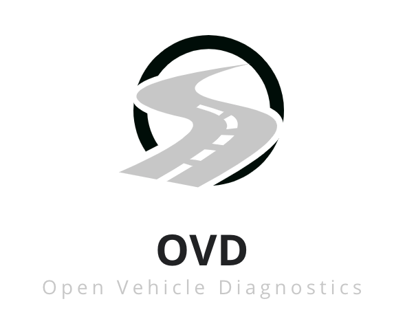

Open Vehicle Diagnostics (OVD) is a Rust-based open source vehicle ECU diagnostic platform that makes use of the J2534-2 protocol, as well as SocketCAN on Linux!

The idea is to make diagnosing and exploring your cars diagnostics functions possible, via an API, thus allowing the ability for you to reprogram ECU’s without the need for a special dealer-only tool.

This is for my University FYP for my degree at the University of Reading

### Latest release
[Version 0.5.0 (10/02/21)](https://github.com/rnd-ash/OpenVehicleDiag/releases/tag/v0.5.0)

## Youtube video playlist
Videos showing OpenVehicleDiag in use and its development progress can be found [here](https://youtube.com/playlist?list=PLxrw-4Vt7xtty50LmMoLXN2iKiUknbMng)

## OpenVehicleDiag ECU JSON Schema
If you want to create diagnostic JSON for your own ECUs, check out the JSON schema [here](SCHEMA.md)

## Repository structure

### app_rust
Directory of the OpenVehicleDiag app (See contained README)

### CBFParser
Parses Mercedes CBF Files into OpenVehicleDiag's JSON

### SMRParser
Parses Mercedes SMR Files into JSON (**DOES NOT FUNCTION FULLY**)

### Common
Common library for both parser and GUI Application

## Project feature checklists - Current status (90%)
Features marked with '(**WIP**)' are actively being developed!
### Reverse engineering framework
- [x] Define a schema in JSON for others to follow 
- [x] User guide on how to write a custom parser for an OEM's Database file
- [x] Reverse engineering note on MB CBF
### Diagnostic application
- [x] J2534-2 API
- [x] Packet tracing support
- [ ] Support K-Line 
- [x] Support CAN 
- [x] Send and receive custom UDS Commands
- [x] Realtime performance data viewer for certain views
- [x] DTC View and clearer
### Macchina J2534 driver
- [x] Support J2534-2 API Passthru functions
- [x] packet Logger
- [ ] ISO9141
- [ ] ISO14230 (KWP2000)
- [x] CAN
- [x] ISO15765 (ISO-TP)
